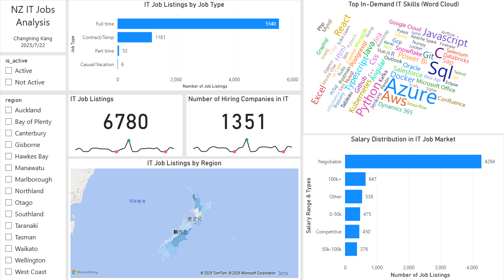
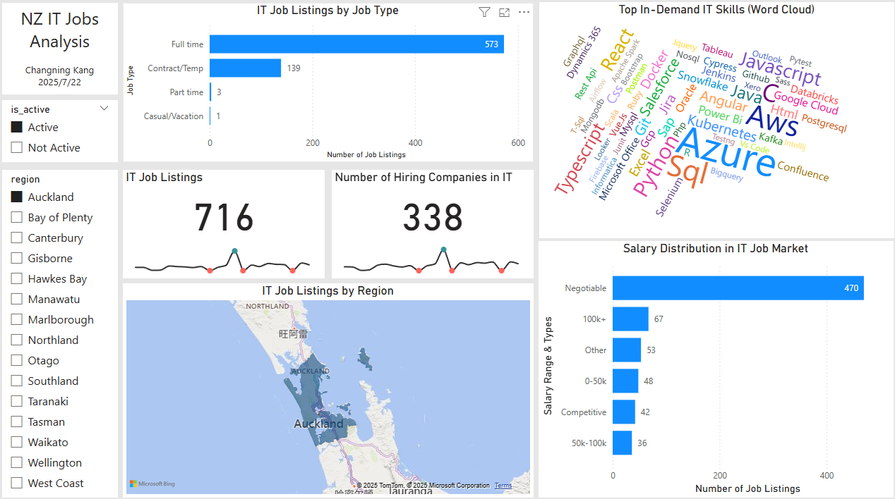

# 💼 NZ IT Job Market Analysis | Power BI Dashboard

This project analyzes IT job market trends in New Zealand using data from local job platforms. It involves systematic data extraction, cleaning, modeling, and visualization, ultimately delivering an interactive Power BI dashboard that presents key insights into job availability, skill demand, job types, and salary distributions.

---

## 🎯 Project Objectives

- Analyze job openings and skill requirements in the NZ IT industry
- Build a standardized **Star Schema** model to support ETL and reporting
- Extract skill keywords from job descriptions and construct a many-to-many bridge table

---

## 📁 Project Structure & Steps

| Step | Description | GitHub Folder |
|------|-------------|----------------|
| ✅ **Step 1: Connect to DB & Design ETL Strategy** | - Connect to MySQL database - Export historical data as CSV - Design full+incremental load strategy | [`step1_connect db and ETL strategy`](./tree/main/step1_connect%20db%20and%20ETL%20strategy) |
| ✅ **Step 2: Data Cleaning & Preprocessing** | - Handle missing values and standardize formats - Extract skills from descriptions (`skills_extracted`) - Normalize skill names | [`step2_data cleaning and preprocessing`](./tree/main/step2_data%20cleaning%20and%20preprocessing) |
| ✅ **Step 3: Construct Star Schema Tables** | - Build `fact_jobs` and all dimension tables (dim_xxx) - Create many-to-many bridge table `fact_job_skills` - Export final schema as CSV for Power BI | [`step3_construct schema tables`](./tree/main/step3_construct%20schema%20tables) |

---

## 📊 Dashboard Preview

The Power BI Dashboard includes:

- ✅ **IT Job Listings by Region / Job Type / Salary Bucket**
- ✅ **Number of Hiring Companies in IT**
- ✅ **Top In-Demand IT Skills (Word Cloud)**
- ✅ **Interactive Filters: Region / is_active / Job Type**

📄 

---

## 🧭 Example: Auckland Region with Active Job Filter

Below is a filtered view of the dashboard showing **only active job listings in Auckland** — one of NZ's largest IT markets:

- **716 active jobs**, posted by **338 companies**
- **Full-time jobs** dominate the market
- **Popular skills** include `Azure`, `SQL`, `Python`, `AWS`, and `JavaScript`
- **Salary distribution** is largely “Negotiable”, followed by 100K+ high-paying roles
- **Map visual** highlights Auckland as a job hotspot

---

## 📦 Tech Stack

- Python (Pandas, NumPy, re, ast) for preprocessing and keyword extraction
- MySQL for data source
- Power BI for interactive visualization (cards, maps, word cloud)
- GitHub for version control

---

# 💼 新西兰 IT 求职市场分析 | Power BI 仪表板

本项目基于新西兰招聘网站的数据，系统性地完成了数据提取、清洗、建模与可视化。最终通过 Power BI 仪表板展示 IT 行业职位需求、技能热度、岗位类型与薪资分布等关键信息，帮助理解当前 IT 市场趋势。

---

## 🎯 项目目标

- 分析新西兰 IT 行业的职位空缺情况与技能需求
- 构建规范的星型数据模型（Star Schema）以支持 ETL 与可视化
- 提取岗位描述中的技能关键词，构建多对多关系桥接表

---

## 📁 项目结构与步骤说明

| 步骤 | 内容 | GitHub 文件夹 |
|------|------|----------------|
| ✅ **Step 1: 数据库连接与 ETL 策略设计** | - 连接 MySQL 数据库 - 导出历史数据为 CSV - 设计“历史全量 + 每日增量”加载策略 | [`step1_connect db and ETL strategy`](./tree/main/step1_connect%20db%20and%20ETL%20strategy) |
| ✅ **Step 2: 数据清洗与预处理** | - 清洗缺失值并规范数据格式 - 提取 `skills_extracted` 技能列 - 标准化技能名称格式 | [`step2_data cleaning and preprocessing`](./tree/main/step2_data%20cleaning%20and%20preprocessing) |
| ✅ **Step 3: 构建 Star Schema 模型表** | - 构建 fact_jobs 与各维度表（dim_xxx） - 构建多对多桥接表 `fact_job_skills` - 导出所有表为 CSV 供 Power BI 使用 | [`step3_construct schema tables`](./tree/main/step3_construct%20schema%20tables) |

---

## 📊 仪表板预览

仪表板内容包括：

- ✅ **职位数量分析：按地区 / 类型 / 薪资等级**
- ✅ **招聘公司数量统计**
- ✅ **IT 热门技能词云**
- ✅ **交互式筛选器：地区 / 是否激活 / 职位类型**

📄 

---

## 🧭 示例视图：奥克兰地区 + Active 职位筛选

以下为筛选器选择「奥克兰（Auckland）」和「Active」后呈现的仪表板视图，展示新西兰最大 IT 市场之一的现状：

- 当前活跃岗位数为 **716**，由 **338 家公司**发布
- **全职（Full-time）岗位**占主导
- 热门技能包含 `Azure`、`SQL`、`Python`、`AWS`、`JavaScript`
- 薪资信息以 **Negotiable（可议）** 为主，其次为 100K+ 高薪岗位
- 地图图层显示奥克兰为主要职位密集区域

---

## 📦 使用技术

- Python（Pandas、NumPy、re、ast）进行数据预处理与技能提取
- MySQL 数据导出
- Power BI 构建交互式仪表板（词云、卡片、地图等）
- GitHub 管理项目版本

---
